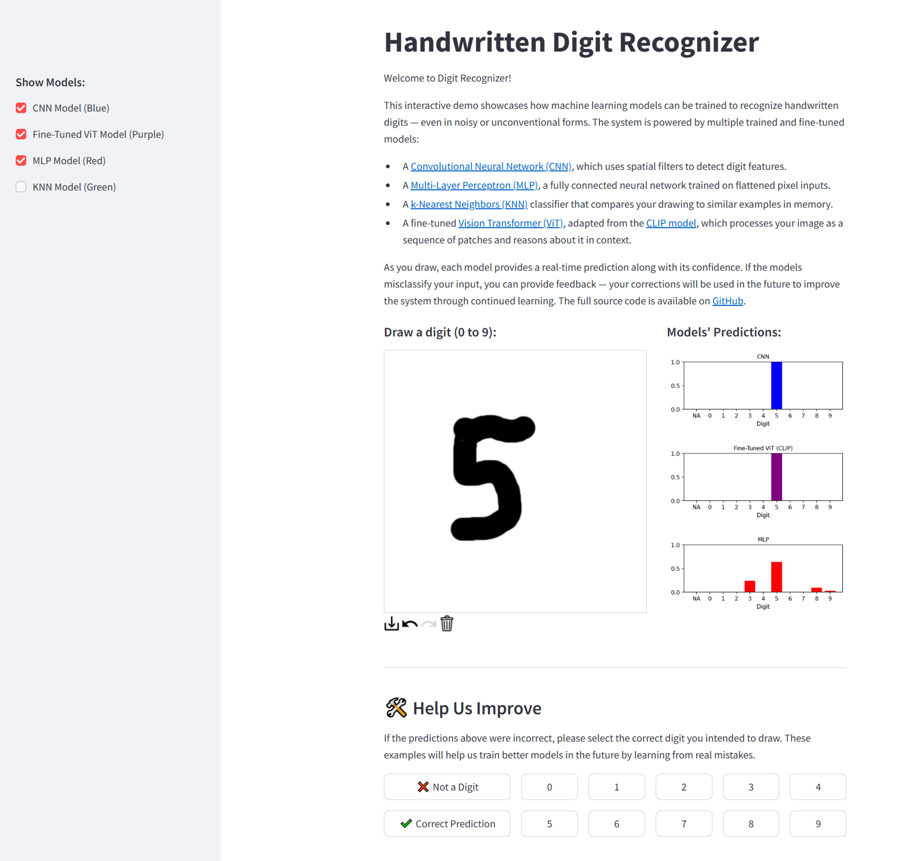

# Digit Recognizer



This interactive web app demonstrates how various machine learning models can be trained to recognize handwritten digits, even when drawn in noisy or unconventional ways. It includes multiple trained and fine-tuned models, each offering a different approach to digit recognition:

- **Convolutional Neural Network (CNN):** Uses spatial filters to detect and interpret visual digit features.
- **Multi-Layer Perceptron (MLP):** A fully connected neural network trained on flattened pixel data.
- **k-Nearest Neighbors (KNN):** Classifies digits by comparing your drawing to stored examples.
- **Fine-tuned Vision Transformer (ViT):** Adapted from the CLIP model, it treats the image as a sequence of patches and makes predictions based on contextual attention.

As the user draws, the app provides real-time predictions and confidence scores from each model. If a prediction is incorrect, the user can submit feedback — this can be used to improve the models over time.  
You can explore the full source code and models in this repository.

---

## 📁 Project Structure

```
.
├── app.py                          # Main Streamlit app
├── inference.py                    # Shared inference and utility functions
├── model_definitions/
│ ├── cnn_model.py                  # CNN model loader and predictor
│ ├── dnn_model.py                  # DNN model loader and predictor
│ ├── simple_nn_model.py            # MLP model loader and predictor
│ ├── vit_classifier_model.py       # CLIP ViT model loader and predictor
├── models/
│ ├── cnn_model.pth                 # Saved CNN model
│ ├── dnn_model.pth                 # Saved DNN model
│ ├── simple_nn_mnist_model.pth     # Saved MLP model
│ ├── clip_digit_classifier.pth     # Saved ViT model
│ ├── X_knn.csv                     # KNN feature vectors
│ ├── y_knn.csv                     # KNN labels
├── digit-recognizer.png            # Project banner
├── requirements.txt                # Python dependencies
├── Dockerfile                      # Docker configuration
├── .gitignore                      # Files to ignore in Git
```

---

## ☁️ Backend Integration & Deployment Flow

---

To support scalable and clean architecture, this project includes a modular **backend API** built with **FastAPI**, containerized with **Docker**, and deployable via **AWS** services. The Streamlit app interacts with this backend to run predictions and serve results efficiently.

### 🔧 Backend API with FastAPI
- We implemented a simple but robust REST API using [FastAPI](https://fastapi.tiangolo.com/) that exposes endpoints for:
  - Loading and serving predictions from the trained models (CNN, MLP, ViT).
  - Handling digit classification requests.
- This allows decoupling model inference from the frontend UI, improving flexibility and response time.

### 📦 Containerization with Docker
- The entire project is Dockerized to ensure consistent environments across development, testing, and deployment.
- Models and dependencies are bundled into containers for reproducible inference services.

### ☁️ Deployment via AWS
- The Docker container is deployed to AWS (e.g., ECS or EC2) to provide a persistent backend service.
- The API is publicly accessible and securely callable by the Streamlit frontend.

### 🎨 Streamlit Frontend
- The Streamlit app acts as the user-facing interface, calling the FastAPI backend for predictions.
- This separation ensures a responsive, interactive UI without compromising performance.

---

### 🔗 System Diagram (Conceptual)

[User Input → Streamlit UI] → [FastAPI Model Server] → [Model Prediction] → [Return to UI]

---

### 🔖 Technologies Used

<table align="center">
  <tr>
    <td align="center">
      <br/>FastAPI
    </td>
    <td align="center">
      <br/>Streamlit
    </td>
    <td align="center">
      <br/>Docker
    </td>
    <td align="center">
      <br/>AWS
    </td>
  </tr>
</table>

## ⚙️ Setup Instructions

### 1. Clone the Repository

```bash
git clone https://github.com/DoronLevinson/digit-recognizer.git
cd digit-recognizer
```

### 2. Create and Activate a Virtual Environment

```bash
python -m venv venv
```

- **Windows (PowerShell):**
  ```powershell
  .\venv\Scripts\Activate.ps1
  ```

- **Windows (CMD):**
  ```cmd
  venv\Scripts\activate.bat
  ```

- **Linux/macOS:**
  ```bash
  source venv/bin/activate
  ```

### 3. Install Python Dependencies

```bash
pip install -r requirements.txt
```

If you get an error about missing `sklearn`, also run:

```bash
pip install scikit-learn
```

---

## Run the App Locally

```bash
streamlit run app.py
```

Open your browser to [http://localhost:8502](http://localhost:8502)

---

## How to Use

1. Draw a digit (0–9) in the canvas area.
2. Toggle which models to display in the sidebar.
3. View the predictions and confidence bars on the right side.
4. Optionally, submit feedback on incorrect predictions.

---

##Author
Doron Levinson
[LinkedIn Profile](https://www.linkedin.com/in/doron-levinson/) 
[GitHub Profile](https://github.com/DoronLevinson)

---
